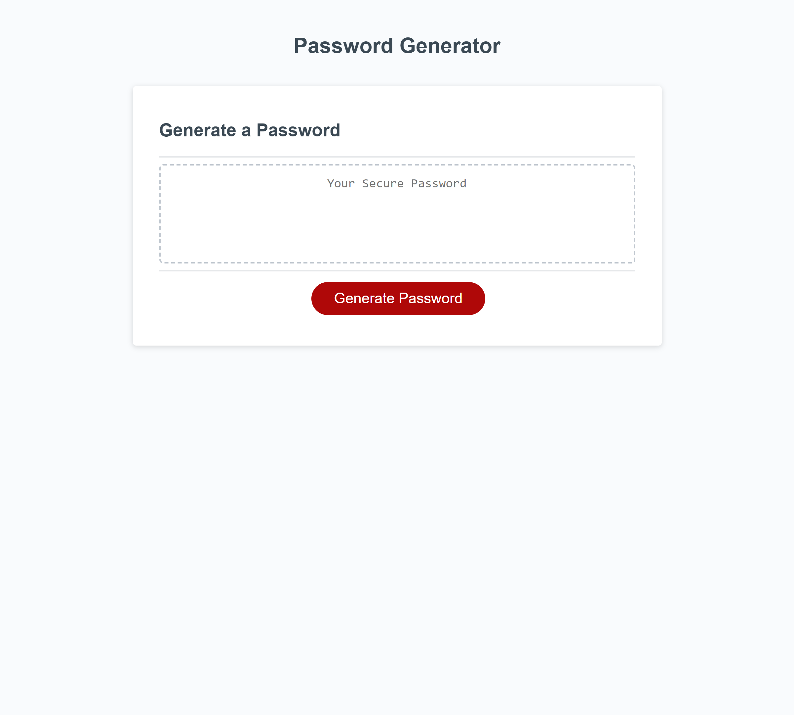

# Random Password Generator

## Description

This website's primary fuction is to use Javascript to generate a random password based on user inputs. These passwords are random and can be up to 128 characters long, making the password as secure as is needed. Whilst building the program, I learned plenty about Javascript, including but not limited to functions, variables, if statements, for loops, window prompts, and more. I also was able to use the DRY principle (Don't Repeat Yourself) to reeuce the code's length significantly.

## Usage

I have attached a screenshot of the website, as well as the website's URL

https://holdenharvey.github.io/random-password-generator/

## Credits

Credit is due to Leif Hetland, my instructor for my SMU Bootcamp course. His help made the random password generation include all the variables input by the user be properly implimented, and also made the coding follow the DRY principle to the best of our abilities.

## License

MIT License

Copyright (c) 2023 Holden Harvey

Permission is hereby granted, free of charge, to any person obtaining a copy
of this software and associated documentation files (the "Software"), to deal
in the Software without restriction, including without limitation the rights
to use, copy, modify, merge, publish, distribute, sublicense, and/or sell
copies of the Software, and to permit persons to whom the Software is
furnished to do so, subject to the following conditions:

The above copyright notice and this permission notice shall be included in all
copies or substantial portions of the Software.

THE SOFTWARE IS PROVIDED "AS IS", WITHOUT WARRANTY OF ANY KIND, EXPRESS OR
IMPLIED, INCLUDING BUT NOT LIMITED TO THE WARRANTIES OF MERCHANTABILITY,
FITNESS FOR A PARTICULAR PURPOSE AND NONINFRINGEMENT. IN NO EVENT SHALL THE
AUTHORS OR COPYRIGHT HOLDERS BE LIABLE FOR ANY CLAIM, DAMAGES OR OTHER
LIABILITY, WHETHER IN AN ACTION OF CONTRACT, TORT OR OTHERWISE, ARISING FROM,
OUT OF OR IN CONNECTION WITH THE SOFTWARE OR THE USE OR OTHER DEALINGS IN THE
SOFTWARE.